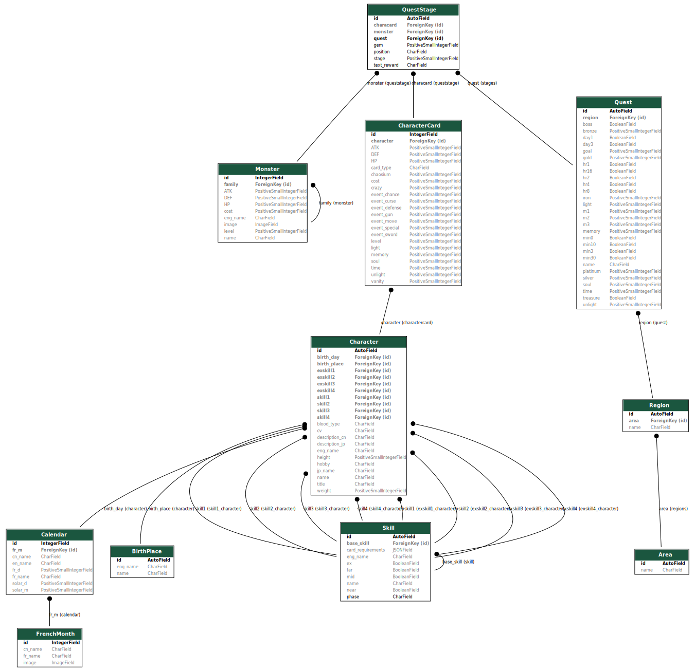

# To Draw Model Structure
## Dependencies
```bash
# macOS Sonoma 14.6.1
brew install graphviz 
CFLAGS="-I/opt/homebrew/include" \                     
LDFLAGS="-L/opt/homebrew/lib" \
pip3 install pygraphviz --no-cache-dir
```
## Create Model Structure Diagram
```
python manage.py graph_models app -o ../Document/model_structure/models.svg
```
